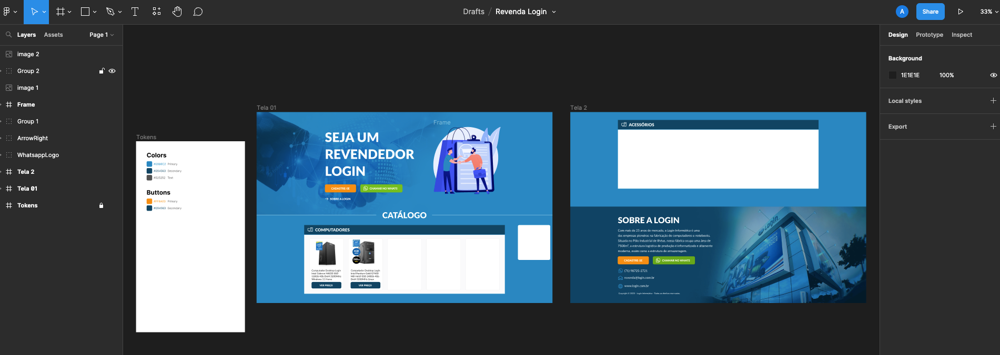
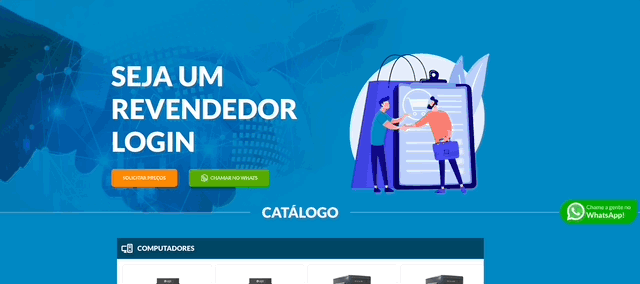
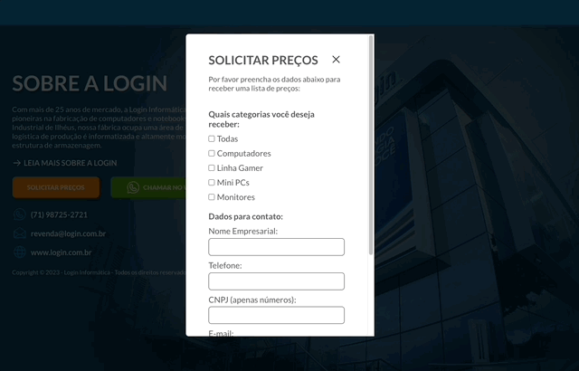

<h1 align="center">Revenda Login - Landing Page</h1>

Landing Page desenvolvida para a Login Informática - empresa de produtos eletrônicos localizada em Salvador-BA. Além de desenvolver o código eu também criei o design da interface no Figma. Utilizado Emailjs para disparo das notificações por e-mail com segurança reCaptcha do Google.

  <h3> 🚀 Publicado 🚀 </h3>
  <strong><a href="https://revenda-login-informatica.vercel.app/" target="_blank">🔗 Visualize o projeto clicando aqui</a></strong>
  <strong><a href="https://www.figma.com/file/q9ospPRUUaKbpuTmpPLPgO/Revenda-Login?node-id=0%3A1&t=pUHH9apMbpN08l7f-1" target="_blank"> / Layout criado no Figma</a></strong>

# Sumário
-[Funcionalidades](#funcionalidades)  
-[Imagens](#imagens) 
-[Tecnologias](#tecnologias) 

# Funcionalidades
- [x] Vitrine de produtos por sessão com carrossel
- [x] Chamadas de ação para o WhatsApp
- [x] Solicitação de visualização do preço do produto utilizando Emailjs
- [x] Responsivo
- [x] Formulário tratado com Regex

# Imagens

# Tecnologias
As ferramentas utilizadas foram:
<ul style="list-style: none">
  <li>React com o Vite</li>
  <li>Typescript</li>
  <li>Radix UI</li>
  <li>Emailjs</li>
  <li>Keen Slider</li>
  <li>Phosphor Icons</li>
  <li>React Router</li>
  <li>Styled Components</li>
</ul>

  <h3> 🚀 Publicado 🚀 </h3>
  <strong><a href="https://revenda-login-informatica.vercel.app/" target="_blank">🔗 Visualize o projeto clicando aqui</a></strong>
  <strong><a href="https://www.figma.com/file/q9ospPRUUaKbpuTmpPLPgO/Revenda-Login?node-id=0%3A1&t=pUHH9apMbpN08l7f-1" target="_blank"> / Layout criado no Figma</a></strong>

# Autor

<a href="https://github.com/devalexsantos">Alex Santos</a>

